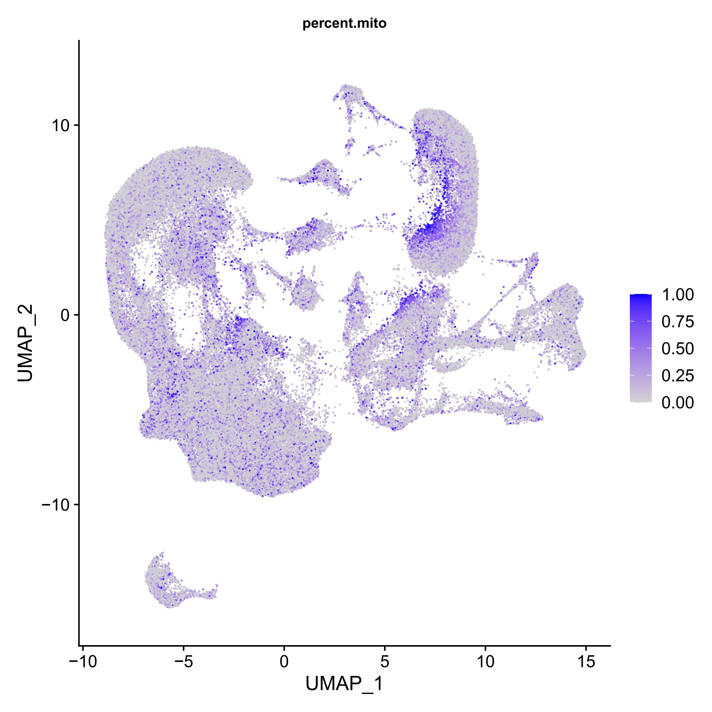
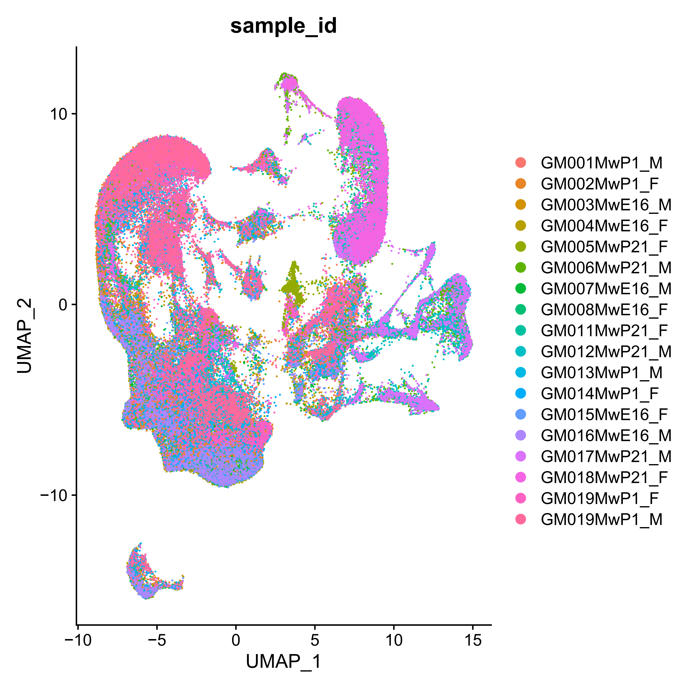
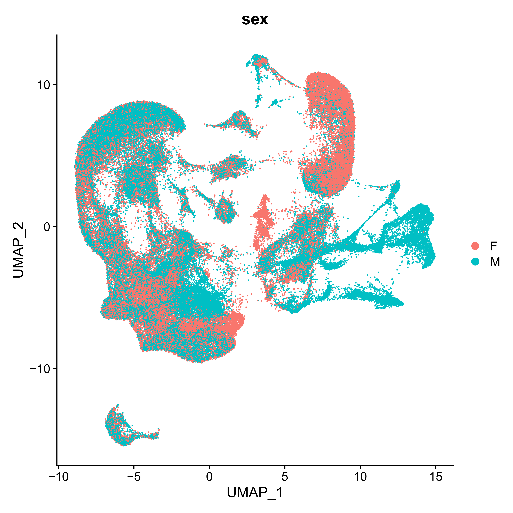

# 🐭 mouseLUTomics

**mouseLUTomics** is a pipeline for analyzing single-cell RNA-seq and ATAC-seq data from mouse lower urinary tract (LUT) tissues. It supports both **multiome** and **single-modality** datasets and includes modules for preprocessing, integration, quality control, and visualization.

---

## 🔬 Overview

This pipeline processes raw FASTQ files into integrated single-cell datasets with downstream cell-type annotation, QC visualization, and marker analysis. It supports:

- scRNA-seq (5’ gene expression)
- scATAC-seq (chromatin accessibility)
- Multi-modal integration (RNA + ATAC)

The project includes two main analysis modes:

- `multiome/`: For paired RNA + ATAC datasets using Seurat, Signac, and ArchR.
- `singleton/`: For RNA-only or ATAC-only single-modality analysis.

---

## 🚀 Getting Started

To run the pipeline:

1. Clone this repository and adjust file paths in shell/R scripts.
2. Run preprocessing scripts:

   ```bash
   bash multiome/01.cellranger.sh
   bash multiome/02.seurat.sh
   bash multiome/03.merge_rna.sh
   ```

3. Perform RNA+ATAC joint analysis:

   ```R
   Rscript multiome/04.joint_analysis_RNA_ATAC.R
   ```

4. View QC outputs in `images/`.

---

## 📊 Quality Control (QC)

The pipeline includes a dedicated QC module evaluating the following:

- **Estimated number of cells**, **reads per cell**, and **genes per cell**
- **Mitochondrial gene expression (%)** to detect stressed/dying cells
- **Doublet score distributions** using Scrublet
- **Sample-level and sex-based clustering**
- **Fragment size and nucleosomal patterning (for ATAC)**

### 📌 QC Summary


---

### 🔋 Mitochondrial Gene Expression

Cells with elevated mitochondrial content often indicate poor quality.



---

### ⚠️ Doublet Detection with Scrublet

UMAP visualization of predicted doublets in RNA data.


---

### 🧬 Sample Origin Clustering

UMAP colored by original sample label.



---

### ♂️♀️ Sex-Based Clustering

Sex-linked gene expression across cells.



---

## 🧼 Doublet Detection Scripts

Doublet filtering is performed using Scrublet via automated scripts located in:

```
analysis/QC/doublets/
├── scrublet-RNA-auto.sh
├── scrublet-ATAC-auto.sh
├── combining-sn-and-atac-scrublet.py
├── scrublet-comboRNA-auto.py
├── scrublet-comboATAC-auto.py
```

These scripts allow for batch-based filtering or customizable single-sample processing.

---

## 📁 Repository Structure

```
.
├── analysis/
│   ├── QC/                        # QC metrics and doublet detection
│   │   ├── QC.R
│   │   └── doublets/
│   └── cell_annotation/          # Marker gene tables & annotation script
├── images/                       # QC plots
│   ├── QC.png
│   ├── rna.umap_mito.png
│   ├── rna.umap_doublets.png
│   ├── rna.umap_sample.png
│   └── rna.umap_sex.png
├── multiome/                     # RNA + ATAC integration pipeline
│   ├── 01.cellranger.sh
│   ├── 02.seurat.sh
│   ├── 03.merge_rna.sh
│   ├── 03.merge_atac.sh
│   ├── 04.joint_analysis_RNA_ATAC.R
│   ├── multiome_pipeline_v1.2_mouse.R
│   └── additional merging utilities
├── singleton/                    # Single-modality analysis scripts
│   ├── 01.cellranger.sh
│   ├── 02.seurat.sh
│   └── 03.merge.sh
└── README.md
```

---

## ⚙️ Script Summary

| Script | Purpose |
|--------|---------|
| `multiome/01.cellranger.sh` | Alignment of paired scRNA/scATAC fastq using Cellranger-ARC |
| `multiome/02.seurat.sh`     | Seurat preprocessing of RNA data |
| `multiome/03.merge_rna.sh`  | Merge Seurat objects across samples |
| `multiome/04.joint_analysis_RNA_ATAC.R` | Joint integration of RNA + ATAC data |
| `analysis/QC/QC.R`          | QC metric calculation and plot generation |
| `singleton/*.sh`            | For RNA-only analysis pipelines |

---

## 📦 Requirements

- R >= 4.2
- `Seurat`, `Signac`, `ArchR`, `DoubletFinder`, `ggplot2`
- Python >= 3.7 (for Scrublet)
- `cellranger` or `cellranger-arc`

---

## 📄 License

This project is released under the MIT License.

---

## 🙌 Acknowledgements

This work uses scRNA-seq and scATAC-seq data generated as part of the mouse lower urinary tract (LUT) development study. Pipeline adapted from best practices in Seurat, ArchR, and Scrublet.

---
