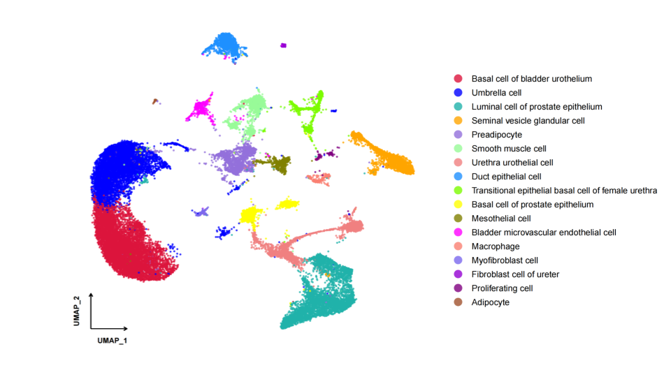

# 🐭 mouseLUTomics

**mouseLUTomics** is a pipeline for analyzing single-cell RNA-seq and ATAC-seq data from mouse lower urinary tract (LUT) tissues. It supports both **multiome** and **single-modality** datasets and includes modules for preprocessing, integration, quality control, and cell type annotation.

---

## 🔬 Overview

This pipeline processes raw FASTQ files into integrated single-cell datasets with downstream QC visualization, doublet detection, and cell-type annotation.  
It supports:

- scRNA-seq (5’ gene expression)
- scATAC-seq (chromatin accessibility)
- Multi-modal integration (RNA + ATAC)

The repository includes two analysis modes:

- `multiome/`: For paired RNA + ATAC datasets using Seurat, Signac, and ArchR.
- `singleton/`: For single-modality datasets (scRNA or scATAC only).

---

## 🚀 Getting Started

To run the pipeline:

1. Clone this repository and adjust file paths in shell/R scripts.
2. Run preprocessing scripts:

   ```bash
   bash multiome/01.cellranger.sh
   bash multiome/02.seurat.sh
   bash multiome/03.merge_rna.sh
   ```

3. Perform RNA+ATAC joint analysis:

   ```R
   Rscript multiome/04.joint_analysis_RNA_ATAC.R
   ```

4. View QC outputs in the `images/` folder.

---

## 📊 Quality Control (QC)

The pipeline includes a dedicated QC module that evaluates:

- **Estimated number of cells**, **reads per cell**, **genes per cell**
- **Mitochondrial gene expression (%)**
- **Doublet score distributions** using Scrublet
- **Sample origin and sex-based clustering**

### 📌 QC Summary


---

### 🔋 Mitochondrial Gene Expression

Cells with elevated mitochondrial content may indicate poor quality.


---

### ⚠️ Doublet Detection with Scrublet

UMAP visualization of predicted doublets in RNA data.


---

### 🧬 Sample Origin Clustering

UMAP colored by original sample label.


---

### ♂️♀️ Sex-Based Clustering

UMAP colored by sex-linked transcriptional programs.


---

## 🧾 Cell Type Annotation

Cell clusters were annotated using canonical marker genes, tissue-specific knowledge, and developmental references.  
The following UMAP shows final cell identities at postnatal day 21 (P21):



> Identified cell types include umbrella cells, basal urothelial cells, prostate epithelium, smooth muscle, fibroblasts, endothelial cells, and more.

---

## 🧼 Doublet Detection Scripts

Doublets are filtered using **Scrublet** (Python) via automated shell and Python scripts in:

```
analysis/QC/doublets/
├── scrublet-RNA-auto.sh
├── scrublet-ATAC-auto.sh
├── combining-sn-and-atac-scrublet.py
├── scrublet-comboRNA-auto.py
├── scrublet-comboATAC-auto.py
```

---

## 📁 Repository Structure

```
.
├── analysis/
│   ├── QC/
│   │   ├── QC.R
│   │   └── doublets/
│   └── cell_annotation/
│       ├── analysis.R
│       └── marker_genes.tsv
├── images/
│   ├── QC.png
│   ├── rna.umap_mito.png
│   ├── rna.umap_doublets.png
│   ├── rna.umap_sample.png
│   ├── rna.umap_sex.png
│   └── cell_annotation_P21.png
├── multiome/
│   ├── 01.cellranger.sh
│   ├── 02.seurat.sh
│   ├── 03.merge_atac.sh
│   ├── 03.merge_rna.sh
│   ├── 04.joint_analysis_RNA_ATAC.R
│   ├── multiome_pipeline_v1.2_mouse.R
│   └── other merging/integration scripts
├── singleton/
│   ├── 01.cellranger.sh
│   ├── 02.seurat.sh
│   └── 03.merge.sh
└── README.md
```

---

## ⚙️ Script Summary

| Script | Purpose |
|--------|---------|
| `multiome/01.cellranger.sh` | Alignment of paired RNA + ATAC FASTQ files using Cellranger ARC |
| `multiome/02.seurat.sh`     | Seurat-based RNA preprocessing |
| `multiome/03.merge_rna.sh`  | Merge Seurat objects across samples |
| `multiome/04.joint_analysis_RNA_ATAC.R` | RNA + ATAC integration & joint UMAP |
| `analysis/QC/QC.R`          | QC metrics + violin/UMAP plots |
| `singleton/*.sh`            | Single-modality (RNA-only or ATAC-only) workflows |

---

## 📦 Requirements

- R ≥ 4.2  
  Required R packages: `Seurat`, `Signac`, `ArchR`, `DoubletFinder`, `ggplot2`, etc.  
- Python ≥ 3.7  
  With `scrublet`, `numpy`, `scikit-learn`, `matplotlib`, etc.  
- `cellranger` or `cellranger-arc`

---

## 📄 License

This project is released under the **MIT License**.  
Please cite relevant tools (Seurat, ArchR, Scrublet) if used in your publications.

---

## 🙌 Acknowledgements

This work is part of a project on mouse LUT tissue development.  
The pipeline integrates best practices from Seurat, Signac, ArchR, and Scrublet, and is designed for reproducible single-cell multi-omics analysis.

---
